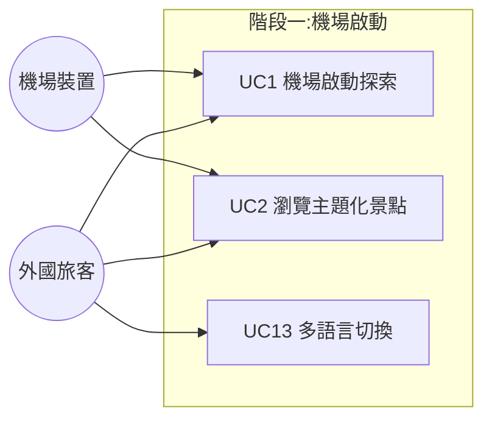
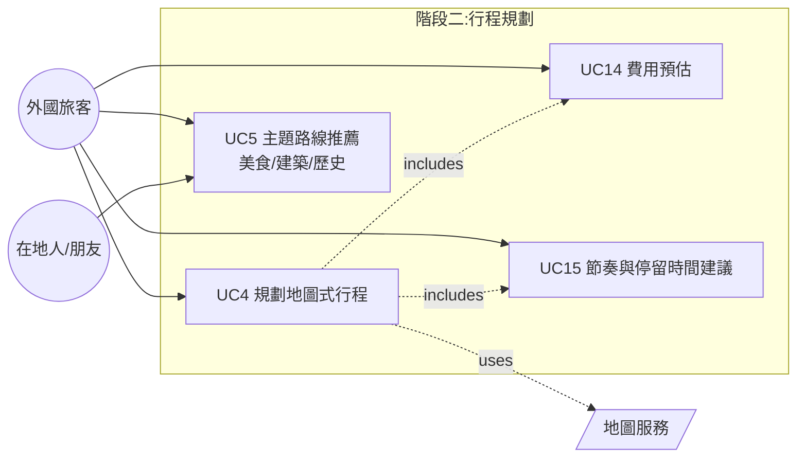
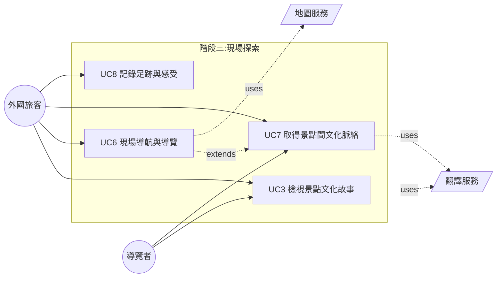
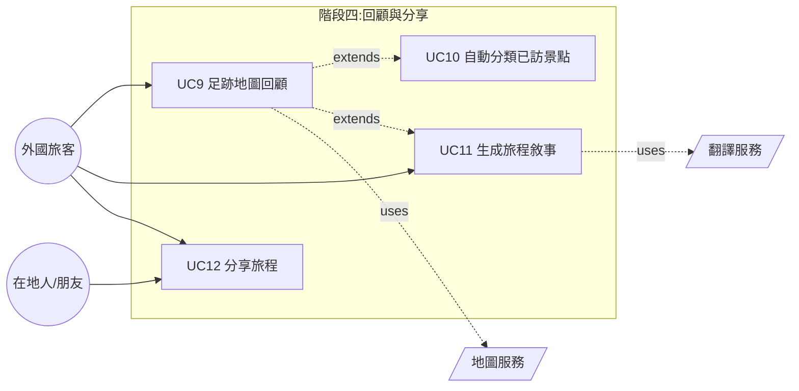
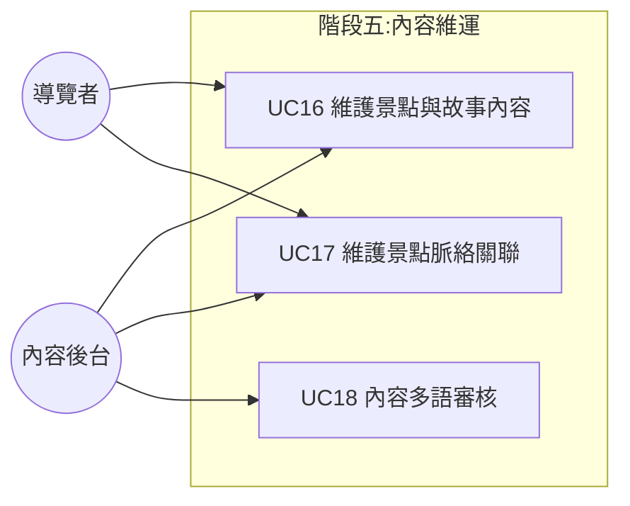
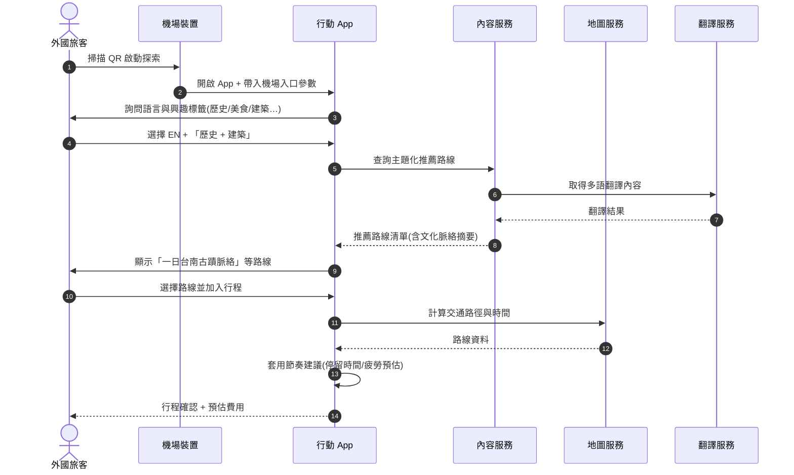
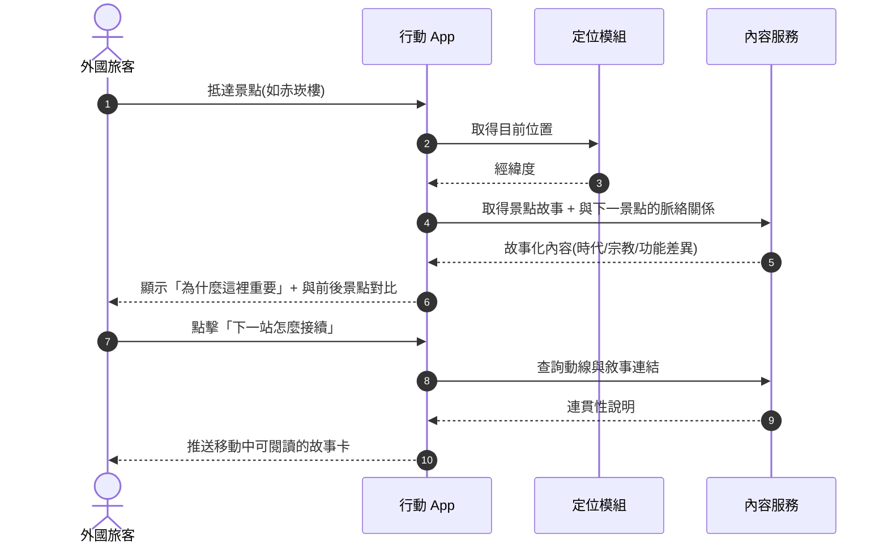
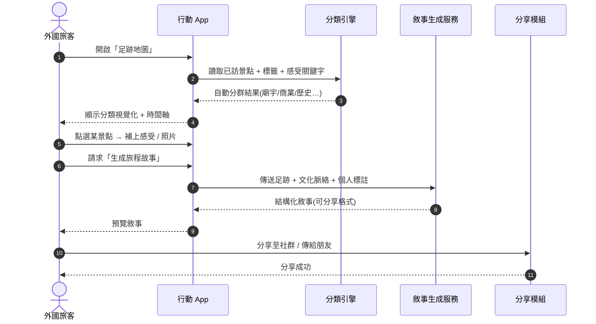

# 系統需求文件

> 專案:外國旅客在台灣初期探索文化的體驗設計
> 來源報告:`report.md`(期中報告)
> 設計核心:重新設計「文化被理解的方式」— 解決資訊存在卻無法被連結與理解的問題。

---

## 1. 系統概述 (System Overview)

針對外國自由行旅客(尤其非中文母語者)從**機場抵達 → 城市探索 → 景點參觀 → 旅程回顧**的完整路徑,提供:

- 結構化、故事化的台灣文化內容
- 主題化路線(美食、建築、歷史等)與地圖式行程規劃
- 現場導覽與情境化解說
- 旅程後的足跡回顧與敘事生成

---

## 2. Actors

| Actor | 說明 |
|---|---|
| **外國旅客 (Foreign Tourist)** | 主要使用者,通常為非中文母語者,於機場/城市初期使用。**Persona 核心依「行為模式 — 深度文化探索者」定義,非以國籍區分**;台灣本地人若具相同深度連結需求亦屬此類。(逐字稿 00:20:06–00:21:15 Speaker 8 回饋:persona 應依行為而非國籍拆解) |
| **在地人 / 朋友 (Local Resident)** | 陪同旅客探索,提供推薦與分享。 |
| **導覽者 / 文化工作者 (Cultural Guide)** | 推廣在地文化,需依對象調整內容深度。 |
| **機場互動裝置 (Airport Kiosk)** | 大型展示裝置,作為文化入口。 |
| **內容後台 (Content Admin)** | 維護景點、故事、文化脈絡資料。 |
| **地圖服務 (Map Service)** | 外部系統,提供導航與位置。 |
| **翻譯服務 (Translation Service)** | 外部系統,提供多語轉譯。 |

---

## 3. Use Case List

| ID | Use Case | 主要 Actor | 階段 | 描述 |
|---|---|---|---|---|
| UC1 | 機場啟動探索 | 外國旅客 / 機場裝置 | 啟動 | 透過機場 Kiosk 掃 QR 或開啟 App,進入文化探索流程。 |
| UC2 | 瀏覽主題化景點 | 外國旅客 / 機場裝置 | 啟動 | 以主題(歷史/美食/建築…)分類瀏覽景點概覽。 |
| UC3 | 檢視景點文化故事 | 外國旅客 / 導覽者 | 探索 | 顯示單一景點的故事化內容(時代背景、宗教、功能)。 |
| UC4 | 規劃地圖式行程 | 外國旅客 | 規劃 | 在地圖上加入/排序景點,以時間軸呈現行程。 |
| UC5 | 主題路線推薦 | 外國旅客 / 在地人 | 規劃 | 系統依主題自動產生整條路線(如「美食吃到掛」「不同時期建築」)。 |
| UC6 | 現場導航與導覽 | 外國旅客 | 探索 | 從目前位置導航至下一景點,並推送移動中故事卡。 |
| UC7 | 取得景點間文化脈絡 | 外國旅客 / 導覽者 | 探索 | 顯示景點之間的時代/宗教/功能差異與連結。 |
| UC8 | 記錄足跡與感受 | 外國旅客 | 探索 | 用關鍵字 + 感受快速記錄,不需長文字。 |
| UC9 | 足跡地圖回顧 | 外國旅客 | 回顧 | 以地圖呈現已造訪景點,可點擊查看當時內容與照片。 |
| UC10 | 自動分類已訪景點 | 外國旅客 | 回顧 | 系統依屬性自動分群(廟宇/商業/歷史)。 |
| UC11 | 生成旅程敘事 | 外國旅客 | 回顧 | 依足跡 + 文化脈絡 + 個人標註生成可分享的結構化故事。 |
| UC12 | 分享旅程 | 外國旅客 / 在地人 | 回顧 | 將敘事或足跡地圖分享至社群或傳給朋友。 |
| UC13 | 多語言切換 | 外國旅客 | 啟動 | 切換 UI 與內容語言(至少繁中/簡中/英)。 |
| UC14 | 費用預估 | 外國旅客 | 規劃 | 顯示行程總開銷預估(交通、門票、餐飲)。 |
| UC15 | 節奏與停留時間建議 | 外國旅客 | 規劃 | 依景點規模、距離、體力建議停留時間與疲勞預估。 |
| UC16 | 維護景點與故事內容 | 內容後台 / 導覽者 | 維運 | 新增、編輯景點、故事與多語版本。 |
| UC17 | 維護景點脈絡關聯 | 內容後台 / 導覽者 | 維運 | 建立跨景點的時代、主題、宗教關聯,供 UC7 使用。 |
| UC18 | 內容多語審核 | 內容後台 | 維運 | 翻譯內容人工校對,避免文化詞彙誤譯。 |

### 關係摘要 (Include / Extend / Uses)

| 關係 | 來源 | 目標 | 說明 |
|---|---|---|---|
| `<<include>>` | UC4 | UC14 | 規劃行程時必算費用 |
| `<<include>>` | UC4 | UC15 | 規劃行程時必算節奏 |
| `<<extend>>` | UC2 | UC3 | 從清單點開即進入故事頁 |
| `<<extend>>` | UC6 | UC7 | 導航中可選擇查看脈絡 |
| `<<extend>>` | UC9 | UC10 | 回顧頁可顯示分類視覺化 |
| `<<extend>>` | UC9 | UC11 | 回顧頁可觸發敘事生成 |
| `uses` | UC4, UC6, UC9 | 地圖服務 | 路徑與位置 |
| `uses` | UC3, UC7, UC11 | 翻譯服務 | 多語內容 |

---

## 4. Use Case Diagrams

依旅程階段拆為 5 張子圖,便於閱讀。完整 Use Case 編號 UC1–UC16 維持一致。

### 3.1 機場啟動 (Onboarding @ Airport)

### 3.2 行程規劃 (Trip Planning)

### 3.3 現場探索與導覽 (On-site Exploration)

### 3.4 旅程回顧與分享 (Review & Share)

### 3.5 內容管理 (Content Management)

---

## 5. Sequence Diagrams

### 5.1 抵達機場 → 規劃首個文化行程

對應 Story Board 1 「資訊過載 → 決策停滯」痛點。

### 5.2 現場導覽:景點間文化脈絡

對應 KJ Insight「文化資訊缺乏連結」。

### 5.3 旅程結束:足跡回顧 + 敘事生成

對應 Story Board 2「記憶混合 / 意義流失」痛點。

---

## 6. Functional Requirements

| ID | 需求 | 對應痛點 / 來源 |
|---|---|---|
| **FR-01** 機場入口啟動 | 系統應提供機場大型裝置與行動 App 的串接(QR / NFC),讓旅客在等待時即可開始探索。 | 機場為文化入口但體驗碎片化 |
| **FR-02** 興趣與語言設定 | 首次使用時收集語言、文化興趣(歷史、美食、建築、宗教等),作為個人化推薦依據。 | 推薦不精準、語言障礙 |
| **FR-03** 主題化路線推薦 | 系統應依主題(如「美食之旅」「不同時期建築」)自動產生路線;**須支援多主題複選**(例如「台南特色廟宇 + 在地美食(如割包)」),並以地圖式結合呈現。 | 核心功能 — 路線與脈絡 / 逐字稿 00:00:00 Speaker 1:希望主題可複選並做地圖式結合 |
| **FR-03a** 標籤層次與子分類 | 每一個大主題標籤須支援子層次標籤(例如「美食」下再分「在地小吃 / 甜點 / 時下熱門」),並於規劃與篩選時可多選。 | 逐字稿 00:24:41 Speaker 8:單一 tag 層級過大,需細分層次 |
| **FR-04** 地圖式行程規劃 | 旅客可在地圖上加入/移除/排序景點,並以時間軸呈現先後順序;**不同主題 tag 以不同顏色的路徑/箭頭視覺化**,讓旅客透過與地圖互動完成排程(非冷冰冰的文字行程)。 | 核心功能 — 地圖式行程 / 逐字稿 00:01:32 Speaker 2:透過不同 tag 顏色的箭頭與地圖互動 |
| **FR-05** 景點文化故事檢視 | 每個景點需提供故事化內容(時代背景、宗教、功能差異),非單純展示。**當主題為「美食」時,除推薦清單外須呈現該美食在當地的文化意義與歷史脈絡**(例如割包在台南的淵源),避免僅停留在「吃什麼」層次。 | 古蹟「展示為主」缺故事化 / 逐字稿 00:00:58 Speaker 1:美食之外須讓在地意義被看見 |
| **FR-06** 景點間脈絡關聯 | 顯示「下一個景點」與目前景點在文化、時代、地理上的差異與連結。此為本系統**相對於 Google Maps / 去去等既有行程工具的差異化核心**:提供「為什麼兩個點會被放在同一條路線」的文化敘事,而非單純路徑最佳化。 | 文化內容缺乏連結 / 逐字稿 00:29:44 Speaker 9:須明確與去去/Google 的差異 |
| **FR-07** 即時導航 | 提供從目前位置到下個景點的路線指引(整合外部地圖),需考量**實際交通限制(山路、接駁、換車銜接)**,而非假設點對點直線可達。 | 次要功能 — 交通導航 / 逐字稿 00:02:53 Speaker 1(期待日本式整合換車資訊)、00:17:25 Speaker 6(提醒山路/公車不可忽略) |
| **FR-08** 移動中故事卡 | 在交通/步行過程中推送輕量、可被動接收的故事內容。**即使目的地不是赤崁樓,只要路徑經過亦可推送「此處為赤崁樓」的情境卡**;美食路線則沿途提示附近的在地好吃店家。 | 偏好被動接收與情境體驗 / 逐字稿 00:05:12 Speaker 4:經過赤崁樓順帶介紹的體驗 |
| **FR-09** 多語言內容呈現 | 至少支援中(繁/簡)、英,核心景點介紹須有多語版本。 | 語言障礙 / 缺多語轉譯 / 逐字稿 00:15:40 Speaker 4:外國人資訊稀少且分散 |
| **FR-10** 輕量足跡記錄 | 旅客可用「標籤(tag)」快速記錄當下景點,**不強制輸入文字**,標籤式為預設;具體標籤集與互動形式須經使用者研究驗證後調整,避免預設旅客偏好。 | 旅遊後缺乏記錄機制 / 逐字稿 00:07:34–00:08:04 Speaker 4(tag 型輕量化)+ 00:30:45 Speaker 9(不要預設使用者喜歡什麼) |
| **FR-11** 自動分類已訪景點 | 系統依景點屬性自動分群(廟宇 / 商業 / 歷史…)。 | 核心功能 — 分類可視化 |
| **FR-12** 足跡地圖回顧 | 以地圖呈現已造訪地點,點擊可開啟當時內容與照片。**新用戶(尚未累積足跡)之回顧分頁須有替代內容**(例如精選他人足跡 / 官方路線推薦),避免空白狀態。 | 核心功能 — 足跡回顧 / 逐字稿 00:06:17–00:07:32 Speaker 3:沒去過的使用者該顯示什麼須處理 |
| **FR-13** 旅程敘事生成 | 系統依足跡 + 文化脈絡 + 個人標註生成可分享的結構化敘事,支援「回顧時出現明信片」等輕量驚喜化呈現(類似寶可梦蒐集的意象)。 | 核心功能 — 敘事生成 / 逐字稿 00:06:13 Speaker 4:明信片式回顧意象 |
| **FR-14** 分享機制 | 將敘事 / 足跡地圖匯出為連結、圖片或社群貼文格式(包含可直接分享給朋友的「地圖路線」形式)。 | 旅客想記錄並分享回憶 / 逐字稿 00:03:21 Speaker 4:分享地圖路線給朋友 |
| **FR-15** 費用預估 | 顯示行程的預估總開銷(交通、門票、餐飲)。 | 次要功能 — 金額預估 |
| **FR-16** 節奏與停留時間建議 | 依景點規模、距離、旅客體力提供停留時間與疲勞預估。 | 次要功能 — 時間安排 |
| **FR-17** 評價系統 | 旅客可對景點評分與留下心得。 | 次要功能 — 評價係統 |
| **FR-18** 內容後台管理 | 文化工作者 / 後台可新增、編輯景點、故事、跨景點脈絡關聯。 | 導覽者需依對象調整內容 |
| **FR-19** 個人化推薦 | 依旅客興趣與已造訪紀錄,動態調整推薦景點與路線。 | 缺乏個人化推薦機制 |
| **FR-20** 機場大型裝置展示模式 | 提供針對 Kiosk 的瀏覽介面(無登入、輕量瀏覽 + QR 帶走行程)。 | 機場現有展示「陽春、無吸引力」 |
| **FR-21** 使用者協作下標籤 (UGC Tagging) | 旅客可協助為新發現的景點/美食補充或建議標籤,由後台審核後納入資料庫,以降低人工建置資料的長期成本。 | 逐字稿 00:24:41 Speaker 8:純人工下 tag 不具規模,需考慮使用者協作 |
| **FR-22** 跨時期 / 跨類型的多元路線 | 除了「同主題路線」,須支援跨時期、跨類別的文化脈絡路線(如「不同時期建築的對照散步」、「廟宇 + 在地小吃複合」),以呈現台南多元性而非單一切片。 | 逐字稿 00:24:12 Speaker 8:避免只有同類型串聯,須保留多元性 |
| **FR-23** 在地商家合作接點 | 保留與在地商家/導覽者合作的接口(例如商家提供的一日遊內容、限時優惠),可作為歷史文化路線中的實際落地點。 | 逐字稿 00:14:03 Speaker 6:歷史文化路線可結合在地商家 |

---

## 7. Non-Functional Requirements

| 類別 | ID | 需求 |
|---|---|---|
| **多語言 / 在地化** | NFR-01 | UI 與內容均需支援多語言,至少:繁中、簡中、英文;字串外部化以利擴充。(逐字稿 00:15:40 Speaker 4) |
| | NFR-02 | 翻譯內容需經人工校對,避免機器翻譯造成文化詞彙誤解(如古蹟、宗教名詞);**對於跨文化概念(如「廟宇」「割包」「赤崁樓歷史脈絡」)需提供在地化的類比或補充說明**,而非字面翻譯。(逐字稿 00:09:16–00:10:03 Speaker 5:不同語種的文化思維不同,需類比轉換) |
| **效能** | NFR-03 | 主要頁面(首頁、景點頁、地圖頁)首屏載入 ≤ 2 秒(4G 環境)。 |
| | NFR-04 | 地圖路線計算回應時間 ≤ 1.5 秒。 |
| | NFR-05 | 故事卡內容應預先快取,於弱網狀態下仍可瀏覽已下載景點。 |
| **可用性 (Usability)** | NFR-06 | 旅客可在 3 步以內從機場 QR → 取得第一條推薦路線。 |
| | NFR-07 | 主要操作可單手完成,並考量在機場拖行李、邊走邊用的情境。 |
| | NFR-08 | 視覺設計強調「第一眼吸引力」,景點封面以高品質圖像呈現。 |
| **無障礙 (Accessibility)** | NFR-09 | 文字需支援放大,色彩對比符合 WCAG 2.1 AA。 |
| | NFR-10 | 所有圖像需提供替代文字(alt text);影片需有字幕。 |
| **可靠性** | NFR-11 | 系統可用度 ≥ 99.5%(月)。 |
| | NFR-12 | 旅客足跡與筆記資料需具離線儲存與雲端同步,且不因斷線而遺失。 |
| **安全 / 隱私** | NFR-13 | 旅客個人資料(位置、足跡、筆記)儲存須加密,並符合 GDPR / 個資法。 |
| | NFR-14 | 預設不蒐集精準位置;需明確徵得同意後再啟用導航。 |
| | NFR-15 | 第三方分享需匿名化或經使用者確認。 |
| **可維護性** | NFR-16 | 內容後台與 App 解耦,文化內容更新無需發版。 |
| | NFR-17 | 景點與故事的關聯模型需支援後續延伸主題(如殖民時期、宗教路線)。 |
| **擴充性** | NFR-18 | **先以台南為 MVP 試點**,資料模型、主題、路線邏輯須在台南驗證可行後再擴張至全台(台北、高雄等),避免一開始就全台佈局導致深度不足。(逐字稿 00:01:32 Speaker 2:先從台南測試再擴張) |
| | NFR-19 | 需支援與機場、博物館等外部裝置整合(API 對外開放)。 |
| **裝置相容** | NFR-20 | 行動端支援 iOS 15+ / Android 10+;Kiosk 端為瀏覽器版本(支援觸控大螢幕)。 |

---

## 8. 設計原則對應

| 報告核心洞察 | 對應設計回應 |
|---|---|
| 問題不在資訊不足,而在無法被理解與連結 | FR-05、FR-06、FR-13 |
| 文化體驗的核心是建立個人意義 | FR-02、FR-10、FR-19 |
| 偏好被動接收和情境體驗 | FR-08、FR-20 |
| 機場為文化入口但碎片化 | FR-01、FR-20 |
| 旅遊後缺乏記憶累積機制 | FR-10、FR-11、FR-12、FR-13 |

---

## 9. 期中口試回饋對照 (Oral Feedback Traceability)

此節整理期中口試(逐字稿 `transcript.txt`)中講者提出的關鍵回饋,並對應至本文件的需求條目,便於後續設計與驗收追蹤。

### 9.1 已納入需求的回饋

| 時間戳 | 講者 | 回饋內容 | 對應需求 |
|---|---|---|---|
| 00:00:00 | Speaker 1 | 想要在同一條路線複選多個主題(如廟宇 + 在地美食),以地圖式結合呈現 | FR-03、FR-04 |
| 00:00:58 | Speaker 1 | 美食不能只是推薦清單,要讓「在地意義」(如割包的淵源)被看見 | FR-05 |
| 00:01:32 | Speaker 2 | MVP 先從台南開始,可行後擴張全台;不同 tag 用不同顏色箭頭互動 | NFR-18、FR-04 |
| 00:02:53 | Speaker 1 | 期待像日本一樣整合換車與實際交通細節 | FR-07 |
| 00:03:21 | Speaker 4 | 分享功能須能直接分享地圖路線給朋友 | FR-14 |
| 00:05:12 | Speaker 4 | 移動中經過赤崁樓即可推送該景點故事 | FR-08 |
| 00:06:13 | Speaker 4 | 回顧採「明信片式」輕量驚喜呈現 | FR-13 |
| 00:06:17 | Speaker 3 | 新用戶尚未有足跡時,回顧頁需有替代內容 | FR-12 |
| 00:07:34 | Speaker 3/4 | 旅程記錄採 tag 型、輕量化,避免逼使用者打字 | FR-10 |
| 00:09:16 | Speaker 5 | 跨語言不只翻譯,還需跨文化思維的類比轉換 | NFR-02 |
| 00:14:03 | Speaker 6 | 歷史文化路線可與在地商家合作 | FR-23 |
| 00:17:25 | Speaker 6 | 交通須考量山路、公車等非直線因素 | FR-07 |
| 00:20:06 | Speaker 8 | Persona 應依行為模式(深度文化探索)拆解,而非國籍 | Actors |
| 00:24:12 | Speaker 8 | 避免只做同類型/同時期串聯,需保留跨時期多元性 | FR-22 |
| 00:24:41 | Speaker 8 | 標籤需細分層次(美食 → 小吃/甜點/熱門);長期需使用者協作下 tag | FR-03a、FR-21 |
| 00:29:44 | Speaker 9 | 需明確與 Google Maps / 去去 的差異化,差異點在於文化脈絡連結 | FR-06 |
| 00:30:45 | Speaker 9 | 不要預設使用者偏好,記錄/回覆方式須經使用者研究驗證 | FR-10 |

### 9.2 尚未納入需求的議題 (待後續設計解決)

以下為口試中被提出、但屬於設計流程或研究層次、尚未直接轉化為系統需求的議題,保留於此以供後續補強:

| 時間戳 | 講者 | 議題 | 後續行動建議 |
|---|---|---|---|
| 00:28:07 | Speaker 9 | 「文化被理解的方式」過於口號,缺乏從使用者研究轉換到具體需求的 data support | 進行針對性使用者研究(目標 persona 實際訪談),補強需求的實證基礎 |
| 00:09:16 | Speaker 5 | 不同語種使用者對同一條路線理解差異大,如何設計真正的跨文化路線? | 於 prototype 階段以多語使用者做可用性測試,驗證 NFR-02 的類比方法 |
| 00:10:12 | Speaker 5 | 目前呈現方式近似「用 GPT prompt 就能做到」,UI/UX 差異化不足 | 優先產出 Figma wireframe 與互動 prototype(Scenario Video 呈現設計而非問題) |
| 00:28:48 | Speaker 9 | Scenario Video 應陳述「解決方案」,期中版本仍在陳述「問題」 | 期末 Scenario 重製:以本文件 FR-03/04/05/06 串成實際使用情境 |

---
